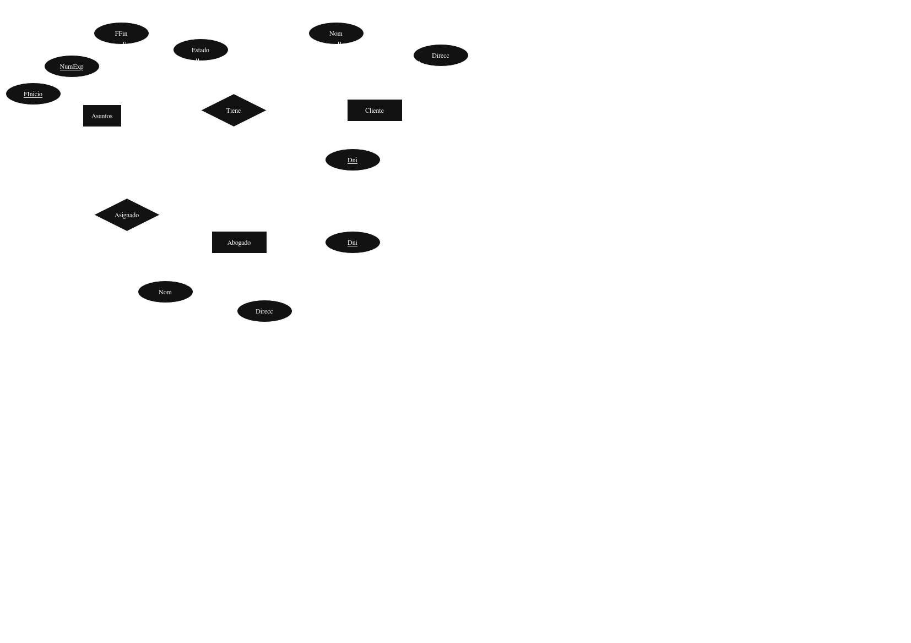
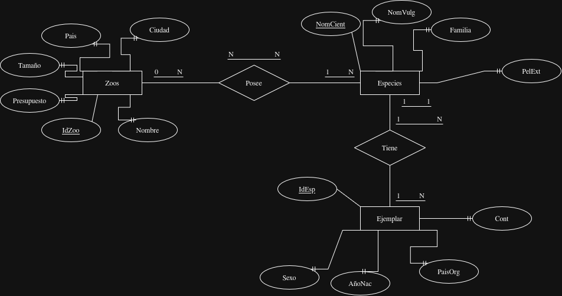
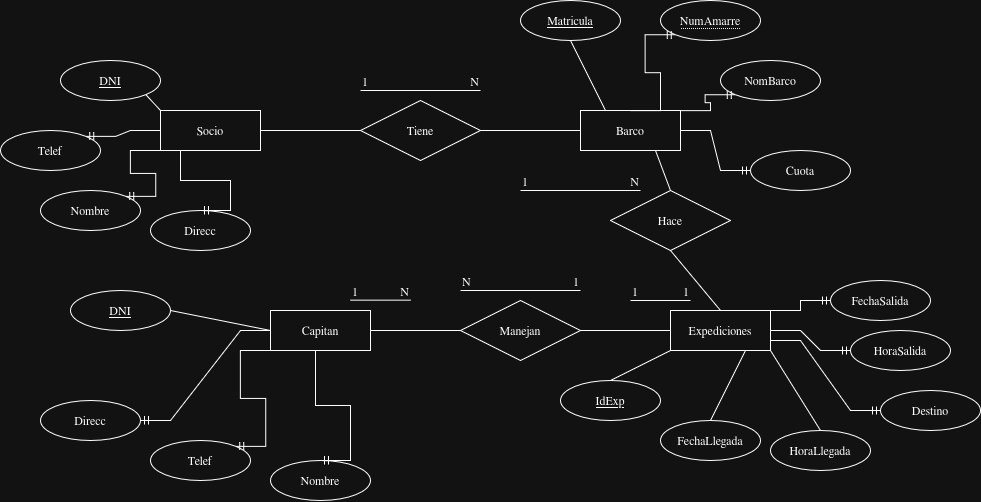
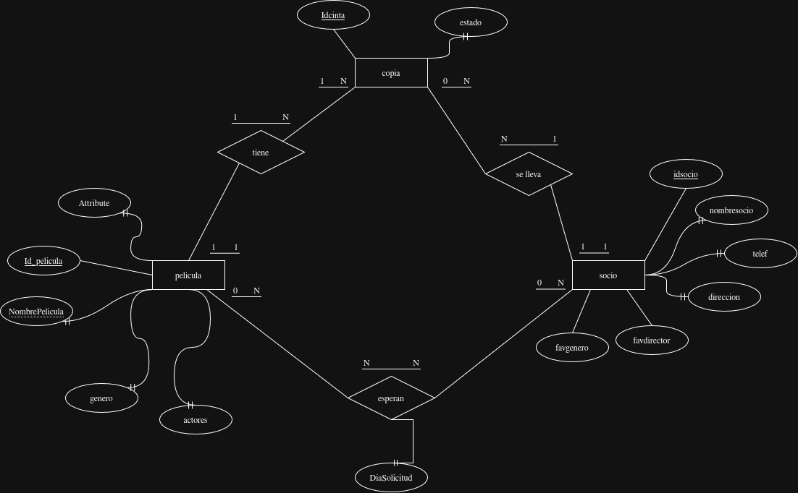
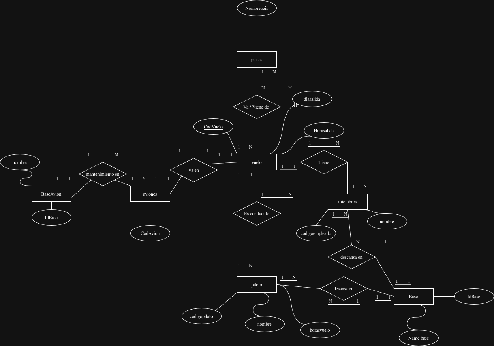
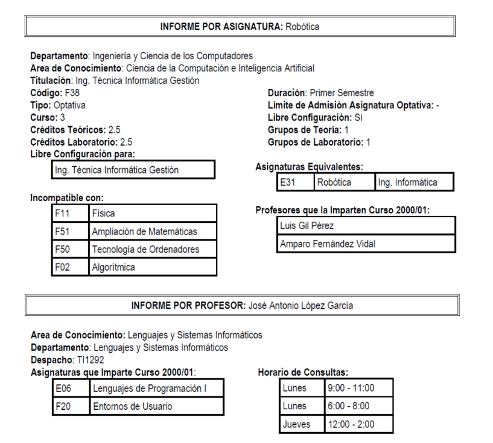
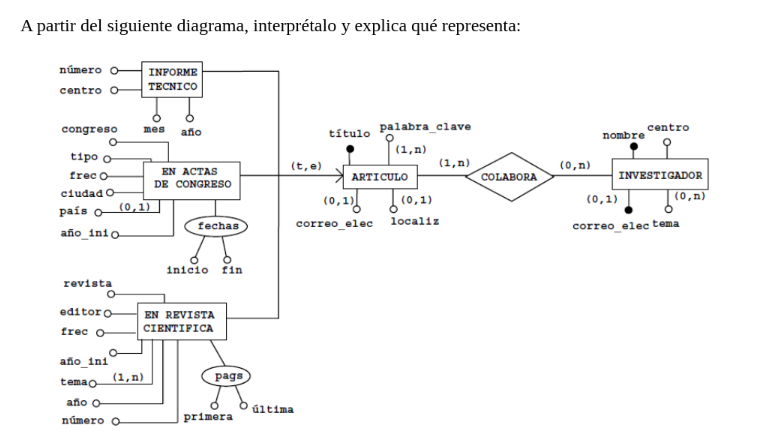

# Ejercicio 1
Se quiere diseñar una base de datos relacional para almacenar información sobre los asuntos que lleva un gabinete de abogados. Cada asunto tiene un número de expediente que lo identifica, y corresponde a un solo cliente. Del asunto se tiene que almacenar el periodo (fecha de inicio y fecha de archivo o finalización), su estado (en trámite, archivado, etc.), así como los datos personales del cliente al cual pertenece (DNI, nombre, dirección, etc.). Algunos asuntos son llevados por uno o varios procuradores, de los cuales nos interesa también los datos personales.

  \

# Ejercicio 2
Se quiere diseñar una base de datos relacional que almacene información relativa a los zoos existentes en el mundo, así como las especies animales que estos albergan. De cada zoo se conoce el nombre, ciudad y país donde se encuentra, tamaño (en metros cuadrados) y presupuesto anual. De cada especie animal se almacena el nombre vulgar y nombre científico, familia a la cual pertenece y si se encuentra en peligro de extinción. Además, se tiene que guardar información sobre cada animal que los zoos poseen, como su número de identificación, especie, sexo, año de nacimiento, país de origen y continente.

  \

# Ejercicio 3
Se quiere diseñar una base de datos relacional para gestionar los datos de los socios de un club náutico. De cada socio se guardan los datos personales y los datos del barco o barcos que posee: número de matrícula, nombre, número del amarre y cuota que paga por este. Además, se quiere mantener información sobre las salidas realizadas por cada barco, como la fecha y hora de salida, el destino y los datos personales del patrón, que no tiene porque ser el propietario del barco, ni es necesario que sea socio del club.

  \

# Ejercicio 4
Se desea diseñar una base de datos relacional que almaceno la información sobre los préstamos de las películas de un video club. En la actualidad la gestión de esta información se realiza de la siguiente manera: Cuando se hace un préstamo se rellena una ficha en la cual se anota el socio que se lleva la película, la fecha y el número de la cinta que se lleva, que es único (de cada película hay varias copias en cintas diferentes). Esta ficha se deposita en el archivador de películas prestadas. Cuando el socio devuelve la cinta, la ficha se pasa al archivador de películas devueltas. El video club tiene, además, un archivador con fichas de películas ordenadas por título; cada ficha tiene además el género de la película (comedia, terror, ...), su director y los nombres de los actores que intervienen. También se tiene un archivador con las fichas de los socios, ordenadas por el código que el video club los da cuando los hace el carné; cada ficha tiene el nombre del socio, su dirección y teléfono, los nombresde sus directores favoritos, los nombres de sus actores favoritos y los géneros cinematográficos de su preferencia. Cuando un socio quiere tomar prestado una película de la cual no hay copias disponibles, se le puede anotar en la lista de espera de esa película. Cada vez que se devuelve una película, se comprueba si hay alguien en su lista de espera, y si es así se telefonea al primer socio de la lista para decirle que ya puede pasar a recogerla, borrándolo después de la lista.

  \

# Ejercicio 5
Se desea almacenar la información de una compañía aérea en una base de datos relacional. La compañía aérea tiene tres recursos principales: aviones, pilotos y miembros de tripulación. De cadapiloto se desea conocer su código, nombre y horas de vuelo. De los miembros de tripulación sólo mantendremos su código y nombre. Todos ellos (pilotos y miembros) tienen una base a la que regresan después de los vuelos de una jornada. Un vuelo que va desde un origen a un destino y a una hora determinada, tiene un número de vuelo (por ejemplo, el vuelo de Palma a Alicante de las 13:50 es el vuelo IB-8830). De cada vuelo que se va a realizar durante los próximos tres meses, así como de los vuelos que ya se han realizado, se desea saber el avión en que se va a hacer o en el que se ha hecho, el piloto y cada uno de los miembros de la tripulación. Cada avión tiene un código, es de un tipo (por ejemplo, BOEING-747) y tiene una base donde es sometido a las revisiones periódicas de mantenimiento

  \

# Ejercicio 6
El servicio de estudiantes de la universidad proporciona información sobre las asignaturas de cada titulación e información sobre los profesores, mediante los tipos de informe que se muestran más adelante Para lo cual, posee un fichero de asignaturas y un fichero de profesores, con los correspondientes programas que se encargan de gestionarlos y que generan estos informes. Dados los problemas de inconsistencia de datos que el sistema de ficheros comporta, se desea diseñar una base de datos relacional que lo sustituya. Algunas aclaraciones que el servicio de estudiantes nos ha hecho son las siguientes: en cada departamento hay varias áreas de conocimiento, cada una de las cuales imparte una serie de asignaturas diferentes en una o varias titulaciones. Cada profesor pertenece a una única área de conocimiento de un departamento e imparte clases en una o varias asignaturas de esa área.

  \

  \

# Ejercicio 7

  \

## Explicaccion:

En primer lugar, articulo, con pk titulo, tiene una relacion con investigador, de muchos a muchos, pues un investigador puede colaborar entre 1 y muchos articulos y en estos articulos pueden haber entre 0 o muchos investigadores, ademas articulo tiene herencias de varios tipos de articulos como informe tecnico, actas de congreso o revistas cientificas

# Ejercicio 8

Las matronas de la seguridad social de una ciudad necesitan un sistema de información para gestionar todo lo relativo a las clases de preparación al parto que se imparten. No todas las matronas dan clases, y las que lo hacen, dan una clase de una hora a la semana y cada una lo hace en un centro diferente. Todas las matronas conocen el horario de consulta de las otras (una matrona puede tener un horario diferente en cada día de la semana) y su centro de atención. Este centro no suele ser el mismo que el centro donde se dan las clases, puesto que este último tiene que tener gimnasio y algún aula dotada de medios audiovisuales. Además, cada matrona tiene asignados varios centros de salud, llevando los embarazos de las mujeres que pertenecen a estos centros. En las clases de preparación al parto se asiste a partir de la semana 30 del embarazo. Cada mujer asiste a las clases del centro que le viene más cómodo, no siendo necesario realizar ninguna inscripción. Antes de cada clase, se tiene que firmar una hoja de asistencia donde se anota el nombre de la mujer, su edad, las semanas de gestación, el número de hijos que tiene, el número de clases a las cuales ha asistido y el nombre de la matrona que le sigue el embarazo. Además de los datos citados anteriormente, de las mujeres embarazadas se quiere conocer su número de la seguridad social y su dirección, además de los datos de su gestación: la fecha de la última regla y la semana de gestación en la que se encuentra. De este modo se puede calcular la semana de gestación en cualquier momento utilizando la fecha actual y la de la última regla. Puesto que cada matrona-profesora solo da una clase a la semana y en un centro diferente, como identificador de la entidad CLASE se puede utilizar, bien el nombre del centro o el nombre de la matrona. Una embarazada puede asistir a clases en diferentes centros. Puesto que se mantiene una relación de muchos a muchos entre EMBARAZADA y CLASE, que tiene una ocurrencia por cada vez que se ha asistido a una clase (para lo cual se toma la fecha), no es necesario tener un atributo que indique el número de clases a las cuales ha asistido.

