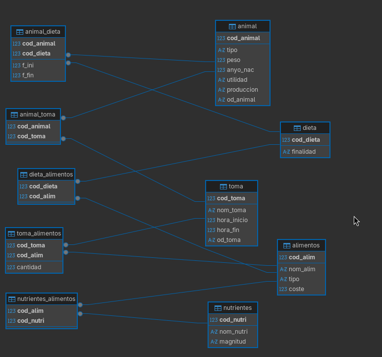

# 0_database.sql

```sql
CREATE DATABASE IF NOT EXISTS dieta_ganadera;


```


## DESC 0_database

```

```

# 10_nutrientes_alimentos.sql

```sql
USE dieta_ganadera;

CREATE TABLE nutrientes_alimentos (
    cod_alim INT,
    cod_nutri INT,
    PRIMARY KEY (cod_alim, cod_nutri),
    FOREIGN KEY (cod_alim) REFERENCES alimentos(cod_alim),
    FOREIGN KEY (cod_nutri) REFERENCES nutrientes(cod_nutri)
);

```


## DESC 10_nutrientes_alimentos

```

Database changed
MariaDB [dieta_ganadera]> DESC nutrientes_alimentos;
+-----------+---------+------+-----+---------+-------+
| Field     | Type    | Null | Key | Default | Extra |
+-----------+---------+------+-----+---------+-------+
| cod_alim  | int(11) | NO   | PRI | NULL    |       |
| cod_nutri | int(11) | NO   | PRI | NULL    |       |
+-----------+---------+------+-----+---------+-------+
2 rows in set (0,001 sec)

```

# 1_animal.sql

```sql
USE dieta_ganadera;

CREATE TABLE animal (
    cod_animal INT PRIMARY KEY,
    tipo VARCHAR(100) NOT NULL,
    peso FLOAT NOT NULL,
    anyo_nac INT NOT NULL, 
    utilidad VARCHAR(100) NOT NULL,
    produccion VARCHAR(100) NOT NULL,
    od_animal VARCHAR(100)
);
```


## DESC 1_animal

```

MariaDB [dieta_ganadera]> DESC animal
    -> ;
+------------+--------------+------+-----+---------+-------+
| Field      | Type         | Null | Key | Default | Extra |
+------------+--------------+------+-----+---------+-------+
| cod_animal | int(11)      | NO   | PRI | NULL    |       |
| tipo       | varchar(100) | NO   |     | NULL    |       |
| peso       | float        | NO   |     | NULL    |       |
| anyo_nac   | int(11)      | NO   |     | NULL    |       |
| utilidad   | varchar(100) | NO   |     | NULL    |       |
| produccion | varchar(100) | NO   |     | NULL    |       |
| od_animal  | varchar(100) | YES  |     | NULL    |       |
+------------+--------------+------+-----+---------+-------+
```

# 2_toma.sql

```sql
USE dieta_ganadera;

CREATE TABLE toma (
    cod_toma INT PRIMARY KEY,
    nom_toma VARCHAR(100) NOT NULL,
    hora_inicio INT NOT NULL,
    hora_fin INT,
    od_toma VARCHAR(100)
);
```


## DESC 2_toma

```
MariaDB [dieta_ganadera]> DESC toma;
+-------------+--------------+------+-----+---------+-------+
| Field       | Type         | Null | Key | Default | Extra |
+-------------+--------------+------+-----+---------+-------+
| cod_toma    | int(11)      | NO   | PRI | NULL    |       |
| nom_toma    | varchar(100) | NO   |     | NULL    |       |
| hora_inicio | int(11)      | NO   |     | NULL    |       |
| hora_fin    | int(11)      | YES  |     | NULL    |       |
| od_toma     | varchar(100) | YES  |     | NULL    |       |
+-------------+--------------+------+-----+---------+-------+
5 rows in set (0,001 sec)
```

# 3_dieta.sql

```sql
USE dieta_ganadera;

CREATE TABLE dieta (
    cod_dieta INT PRIMARY KEY,
    finalidad VARCHAR(100) NOT NULL
);
```


## DESC 3_dieta

```
MariaDB [dieta_ganadera]> DESC dieta;
+-----------+--------------+------+-----+---------+-------+
| Field     | Type         | Null | Key | Default | Extra |
+-----------+--------------+------+-----+---------+-------+
| cod_dieta | int(11)      | NO   | PRI | NULL    |       |
| finalidad | varchar(100) | NO   |     | NULL    |       |
+-----------+--------------+------+-----+---------+-------+
2 rows in set (0,001 sec)
```

# 4_alimentos.sql

```sql
USE dieta_ganadera;

CREATE TABLE alimentos (
    cod_alim INT PRIMARY KEY,
    nom_alim VARCHAR(100) NOT NULL,
    tipo VARCHAR(100) NOT NULL,
    coste FLOAT NOT NULL,
    UNIQUE (nom_alim)
);
```


## DESC 4_alimentos

```

MariaDB [dieta_ganadera]> DESC alimentos;
+----------+--------------+------+-----+---------+-------+
| Field    | Type         | Null | Key | Default | Extra |
+----------+--------------+------+-----+---------+-------+
| cod_alim | int(11)      | NO   | PRI | NULL    |       |
| nom_alim | varchar(100) | NO   | UNI | NULL    |       |
| tipo     | varchar(100) | NO   |     | NULL    |       |
| coste    | float        | NO   |     | NULL    |       |
+----------+--------------+------+-----+---------+-------+
4 rows in set (0,001 sec)
```

# 5_nutrientes.sql

```sql
USE dieta_ganadera;

CREATE TABLE nutrientes (
    cod_nutri INT PRIMARY KEY,
    nom_nutri VARCHAR(100) NOT NULL,
    magnitud VARCHAR(100),
    UNIQUE (nom_nutri)
);
```


## DESC 5_nutrientes

```
MariaDB [dieta_ganadera]> DESC nutrientes;
+-----------+--------------+------+-----+---------+-------+
| Field     | Type         | Null | Key | Default | Extra |
+-----------+--------------+------+-----+---------+-------+
| cod_nutri | int(11)      | NO   | PRI | NULL    |       |
| nom_nutri | varchar(100) | NO   | UNI | NULL    |       |
| magnitud  | varchar(100) | YES  |     | NULL    |       |
+-----------+--------------+------+-----+---------+-------+
3 rows in set (0,001 sec)
```

# 6_animal_toma.sql

```sql
USE dieta_ganadera;

CREATE TABLE animal_toma (
    cod_animal INT,
    cod_toma INT,
    PRIMARY KEY (cod_animal, cod_toma),
    FOREIGN KEY (cod_animal) REFERENCES animal(cod_animal),
    FOREIGN KEY (cod_toma) REFERENCES toma(cod_toma)
);
```


## DESC 6_animal_toma

```
MariaDB [dieta_ganadera]> DESC animal_toma;
+------------+---------+------+-----+---------+-------+
| Field      | Type    | Null | Key | Default | Extra |
+------------+---------+------+-----+---------+-------+
| cod_animal | int(11) | NO   | PRI | NULL    |       |
| cod_toma   | int(11) | NO   | PRI | NULL    |       |
+------------+---------+------+-----+---------+-------+
2 rows in set (0,001 sec)
```

# 7_dieta_alimentos.sql

```sql
USE dieta_ganadera;

CREATE TABLE dieta_alimentos (
    cod_dieta INT,
    cod_alim INT,
    PRIMARY KEY (cod_dieta, cod_alim),
    FOREIGN KEY (cod_dieta) REFERENCES dieta(cod_dieta),
    FOREIGN KEY (cod_alim) REFERENCES alimentos(cod_alim)
);
```


## DESC 7_dieta_alimentos

```
MariaDB [dieta_ganadera]> DESC dieta_alimentos;
+-----------+---------+------+-----+---------+-------+
| Field     | Type    | Null | Key | Default | Extra |
+-----------+---------+------+-----+---------+-------+
| cod_dieta | int(11) | NO   | PRI | NULL    |       |
| cod_alim  | int(11) | NO   | PRI | NULL    |       |
+-----------+---------+------+-----+---------+-------+
2 rows in set (0,001 sec)
```

# 8_animal_dieta.sql

```sql
USE dieta_ganadera;

CREATE TABLE animal_dieta (
    cod_animal INT,
    cod_dieta INT,
    f_ini INT NOT NULL,
    f_fin INT,
    PRIMARY KEY (cod_animal, cod_dieta),
    FOREIGN KEY (cod_animal) REFERENCES animal(cod_animal),
    FOREIGN KEY (cod_dieta) REFERENCES dieta(cod_dieta)
);
```


## DESC 8_animal_dieta

```
MariaDB [dieta_ganadera]> DESC animal_dieta;
+------------+---------+------+-----+---------+-------+
| Field      | Type    | Null | Key | Default | Extra |
+------------+---------+------+-----+---------+-------+
| cod_animal | int(11) | NO   | PRI | NULL    |       |
| cod_dieta  | int(11) | NO   | PRI | NULL    |       |
| f_ini      | int(11) | NO   |     | NULL    |       |
| f_fin      | int(11) | YES  |     | NULL    |       |
+------------+---------+------+-----+---------+-------+
4 rows in set (0,001 sec)
```

# 9_toma_alimentos.sql

```sql
USE dieta_ganadera;

CREATE TABLE toma_alimentos (
    cod_toma INT,
    cod_alim INT,
    cantidad FLOAT NOT NULL,
    PRIMARY KEY (cod_toma, cod_alim),
    FOREIGN KEY (cod_toma) REFERENCES toma(cod_toma),
    FOREIGN KEY (cod_alim) REFERENCES alimentos(cod_alim)
);
```


## DESC 9_toma_alimentos

```

MariaDB [dieta_ganadera]> DESC toma_alimentos;
+----------+---------+------+-----+---------+-------+
| Field    | Type    | Null | Key | Default | Extra |
+----------+---------+------+-----+---------+-------+
| cod_toma | int(11) | NO   | PRI | NULL    |       |
| cod_alim | int(11) | NO   | PRI | NULL    |       |
| cantidad | float   | NO   |     | NULL    |       |
+----------+---------+------+-----+---------+-------+
3 rows in set (0,001 sec)
```


# Diagrama



