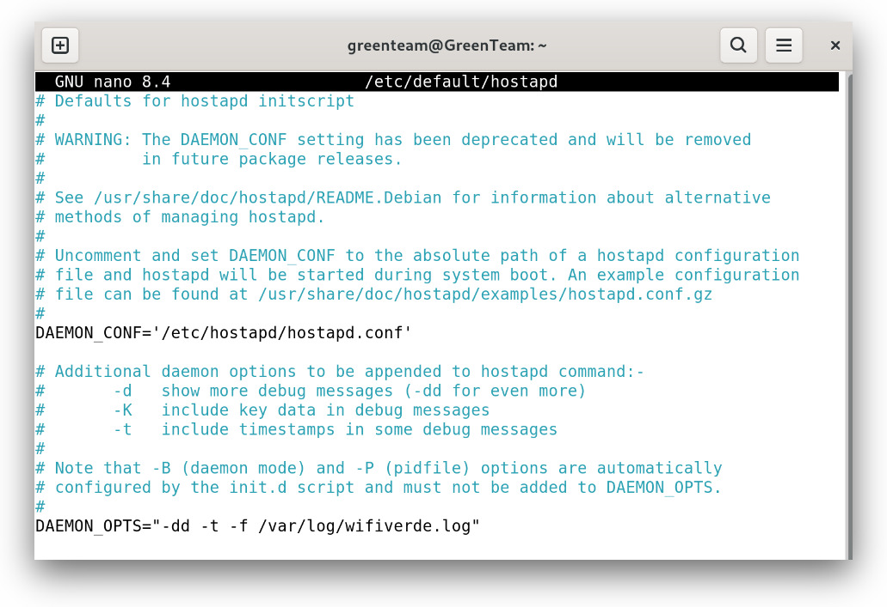
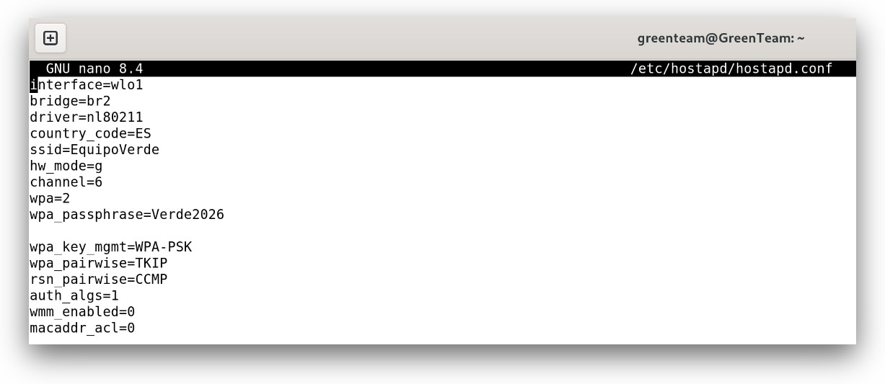
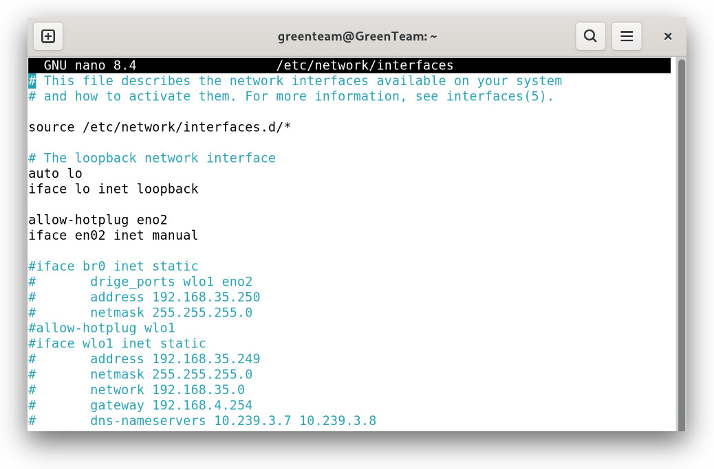
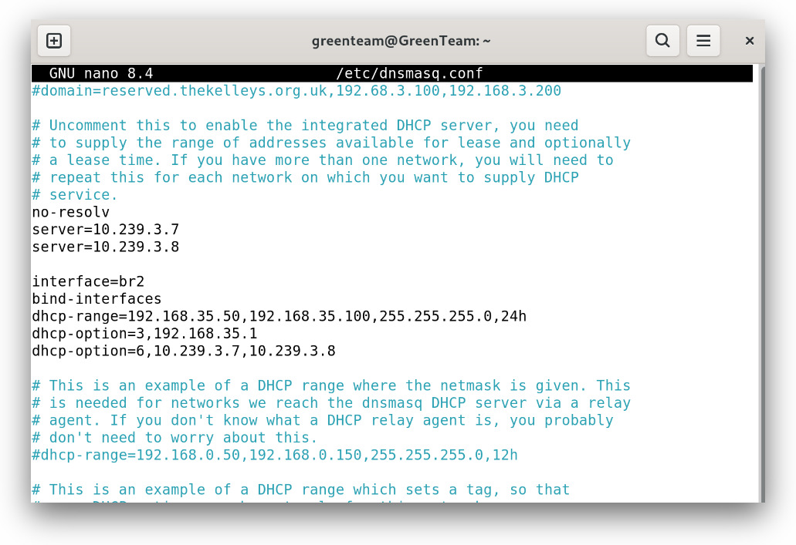

---
#  METADATOS DEL DOCUMENTO
title: "Los portatiles WiFi [Equipo Verde]"
subtitle: "Fundamentos Hardware"
author: "Óscar Hernández, Jesus Aparicio, Hector Villanueva "
date: "8/01/2026"


#  CONFIGURACIÓN DE LA PORTADA Y ESTILO (EISVOGEL)
titlepage: true
titlepage-text-color: "FFFFFF"
titlepage-rule-color: "FFFFFF"
titlepage-background: "./portada.jpg"

#  OTRAS OPCIONES DE FORMATO
lang: "es-ES"
toc: true
toc-own-page: true
number-sections: true
colorlinks: true
links-as-notes: false

#  PIE DE PÁGINA Y NUMERACIÓN
header-left: "FHW"
footer-left: "Óscar H., Jesus A., Hector V."
footer-center: "Pág. \\thepage"
footer-right: "IES La Sénia"
---

# Introducción

En este ejercicio se busca el aprendizaje de los siguientes RA.

<br><br> 

| ID     | Descripción                                                                                 |
|--------|-----------------------------------------------------------------------------------------------|
| RA01.i | Se han utilizado protocolos estándar de comunicación inalámbrica entre dispositivos.          |
| RA03.c | Se han identificado y probado las distintas secuencias de arranque configurables en un equipo |

<br><br> 

Para ello Ángel a diseñado esta maravillosa tarea donde necesitamos modificar diferentes ficheros de configuración para habilitar un punto de acceso con la tarjeta de red de un portátil.

**Nota**: Si tu doggle WiFi soporta el modo ap puedes usarlo, en este caso hemos usado la interfaz WiFi del sistema.

# Version de software instalado

En nustro caso hemos instalado una iso de **Debian 13.2** con interfaz gráfica.

# Ficheros de configuración que se han modificado/establecido.

Para modificar estos ficheros hemos utilizado el comando **nano** como podemos ver en el siguiente ejemplo:

```bash
sudo nano /etc/default/hostapd
```

## /etc/default/hostapd

El primer fichero de configuracion es **/etc/default/hostapd** donde se establecen dos demonios para iniciar el programa con las opciones que aperecen en la captura.




> **Demonio** : es un programa que se ejecuta continuamente en segundo plano para realizar tareas esenciales del sistema, gestionar servicios o monitorizar recursos, funcionando de forma autónoma y persistente.

## /etc/hostapd/hostapd.conf

Este fichero es el que permite que transformemos nuestro ordenador en un punto de acceso Wi-Fi.

En él vamos a configurar y establecer diferentes parámetros que harán funcionar nuestro punto de acceso.



> APD: **ACCES POINT DAEMON**

**Este es el desglose de las configuraciones realizadas:**

1. **Configuración de red**

    - ```interface=wlo1``` 
    
    _Tarjeta de red inalámbrica que se usará._

    - ```bridge=br2``` 
    
    _Permite que los dispositivos conectados compartan la misma red.que los demas conectados a este._

    _**Aviso:** Para que br2 exista deberas de crear primero el bridge, para ello usa estos comandos:_

    ```bash
        sudo brctl addbr br2
        sudo brctl addif br2 wlo1
        sudo ip addr add 192.168.35.1/24 dev br2
        sudo ip link set br2 up
    ```

    - ```driver=n180211``` 
    
    _Define como se va a comunicar el programa hostapd.(Es como un traductor)._

> Para obtener el driver se ha de realizar el comando ```sudo lspci -v | grep -A 20 Network | grep driver``` . En caso de tener problemas con el driver obtenido de esta manera, es recomendado intentar con el uso del driver "nl80211" que funciona en la mayoria de interfaces Wi-Fi. Si el fallo persiste contacte con el Administrador del sistema.

2. **Parámetros de radio y región**

    - ```country_code=ES``` 

    _Asegura que el Wi-Fi use los canales y potencias permitidas legalmente en el país._

    - ```hw_mode=g``` 

    _Define que operará en la banda de 2.4 GHz._

    - ```channel=6``` 

    _Canal 6 de la banda de 2.4 GHz._


3. **Identidad y Seguridad**

    - ```ssid=EquipoVerde``` 

    _Este es el  nombre que saldrá cuando los dispositivos busquen redes para conectarse._

    - ```wpa=2``` 

    _Estandar de seguiridad mas común y seguro._

    - ```wpa_passphrase=Verde2026``` 

    _Contraseña de nuestro Wi-Fi._

    - ```wpa_key_mgmt=WPA-PSK``` 

    _Esto es para que todos los usuarios puedan usar la misma contraseña._


4. **Cifrado**

    Estos son diferentes detalles para que nuestro Wi-Fi funcione correctamente.

    - ```wpa_pairwise=TKIP ```
    - ```rsn_pairwise=CCMP```
    - ```auth_algs=1```
    - ```wmm_enabled=0```
    - ```macaddr_acl=0```

Una vez configurado, inicia y habilita el servicio:

```bash
sudo systemctl enable hostapd.service
sudo systemctl start hostapd.service
```

Y en caso de hacer algun cambio en el fichero deberas reiniciar el servicio o el ordenador

```bash
sudo systemctl restart hostapd.service
```


## /etc/network/interfaces

Aqui vamos a configurar como se va a comportar nuestra o nuestras tarjetas de red.

Para nuestro AP modificamos este fichero para configurar nuestra tarjeta de red de la siguiente manera:



El contenido modificado de este fichero no es mucho, simplemente hacemos que eno2 (La interfaz por cable) obtenga su ip de manera dinamica


## /etc/dnsmasq.conf

Antes de comenzar a configurar este archivo deberemos introducir un par de comandos

```bash
#Para crear el servidor DHCP, necesitamos instalar dnsmasq

sudo apt install dnsmasq

# Iniciar DNSMASQ
sudo systemctl start dnsmasq.service
```

Ahora configuramos el fichero de configuracion como en la imagen



> DNS: **DOMAIN NAME SERVICE**

**Desglose de las configuraciones:**

- ```server=10.239.3.7 y server=10.239.3.8```

_Estos son los servidores dns de conselleria, donde se resolveran los nombres de los dominios_

- ```interface=br2```

_Le indicamos al fichero que trabajaremos sobre la interfaz br2_

- ```bind-interfaces```

_Para que dnsmasq se una a esa interfaz, evitando asi problemas_

- ```dhcp-range=192.168.35.50,192.168.35.100,255.255.255.0,24h```

_Esta linea nos dice la pool de ips que iran de rangos entre el .50 y el .100, seran /24 y una vez asignada, el "lease time" o tiempo de reserva de las ips sera de 24h_

- ```dhcp-option=3,192.168.35.1```

_Este es el gateway para los clientes_

- ```dhcp-option=6,10.239.3.7,10.239.3.8```

_Y estos son los dns que usaran los clientes_

Con todos estos ajustes deberiamos ser capaces de ser detectados por otros equipos, que estos se puedan conectar a nosotros y ser capaces de darles una ip a estos mismos.

Pero aun no podran salir a internet. **Porque?**

# Configuracion de una red NAT

**Que es una red nat?**

Es para permitir que varios dispositivos con IPs privadas puedan comunicarse con Internet usando una IP pública

> NAT: **NETWORK ADDRESS TRANSLATION**

**Como configurarla?**

Usando los siguientes comandos:

```bash
sudo sysctl -w net.ipv4.ip_forward=1
sudo iptables -t nat -A POSTROUTING -o eno2 -j MASQUERADE
sudo iptables -A FORWARD -i br2 -o eno2 -j ACCEPT
sudo iptables -A FORWARD -i eno2 -o br2 -m state --state RELATED,ESTABLISHED -j ACCEPT
sudo iptables-save

#Si queremos que los cambios sean persistentes, debemos instalar:

sudo apt install iptables-persistent

#Y realizar el comando a continuación:

sudo iptables-save | sudo tee /etc/iptables/rules.ipv4
```

*Ahora ya deberias de ser capaz de configurar un punto de acceso en tu dispositivo con Debian 13.2, aunque la mayoria de configuracionas tambien son compatibles con otras distribuciones basadas en Linux.*

# Referencias

[Vivek Gite (March 25, 2024), _Debian / Ubuntu Linux: Setup Wireless Access Point (WAP) with Hostapd_](https://www.cyberciti.biz/faq/debian-ubuntu-linux-setting-wireless-access-point/)

[Debian Documentation](https://wiki.debian.org/es/FrontPage)

[Angel Berlanas Vicente _Consejo y documentacion de un profesional en activo_](https://gitlab.com/aberlanas)


