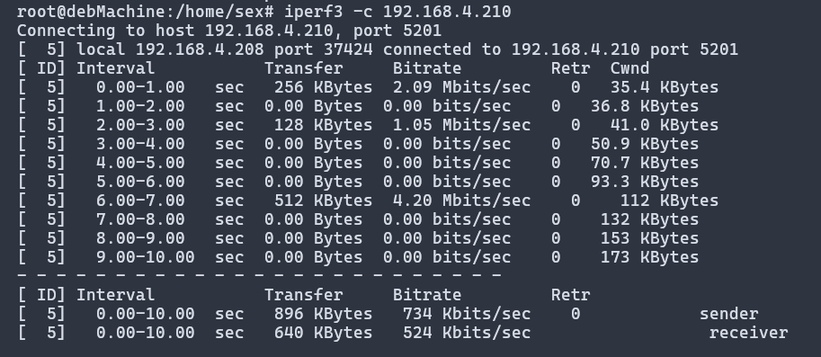

Este es mi examen:

# ej 1

```bash
#!/bin/bash

echo "ESTE SCRIPT ESTA PENSADO PARA SU USO EN debNewBorn CON SU RED NAT"
echo ""

echo -n "Desea activar o desactivar la interfaz?[y/n] - "
read intOnOff

if [ $intOnOff = "y" ]; then
    VBoxManage controlvm debNewborn setlinkstate1 on
elif [ $intOnOff = "n" ]; then
    VBoxManage controlvm debNewborn setlinkstate1 off
else 
    echo "Nonvalid answer"
    exit 1
fi

```

# ej 2

```
# Esta es la red nat 
allow-hotplug NAT_NET
iface NAT_NET inet dhcp

#ESTA ES LA RED PARA COMINICARME CON MI COMPAÑERO
allow-hotplug enp0s8 
auto enp0s8 
iface enp0s8  inet static #AQUI INDICO QUE VA A SER ESTATICA
address 192.168.4.208 #LA IP FIJA QUE ES LA DE CLASE + 200
netmask 255.255.255.0 #LA MASCARA DE RED
gateway 192.168.4.254 #A DONDE TIENE QUE IR PARA BUSCAR INTERNET
dns-nameservers 10.239.3.7 10.239.3.8 # LOS DNS DE CONSELLERIA


# This is an autoconfigured IPv6 interface
iface enp0s3 inet6 auto
```
comprobara lo del icmp con este script

```bash
while true; do
    ping 192.168.4.208 -c2
    sleep 5
done
```


# ej 3

este es mi tc


y este es el de mi compañero martin



