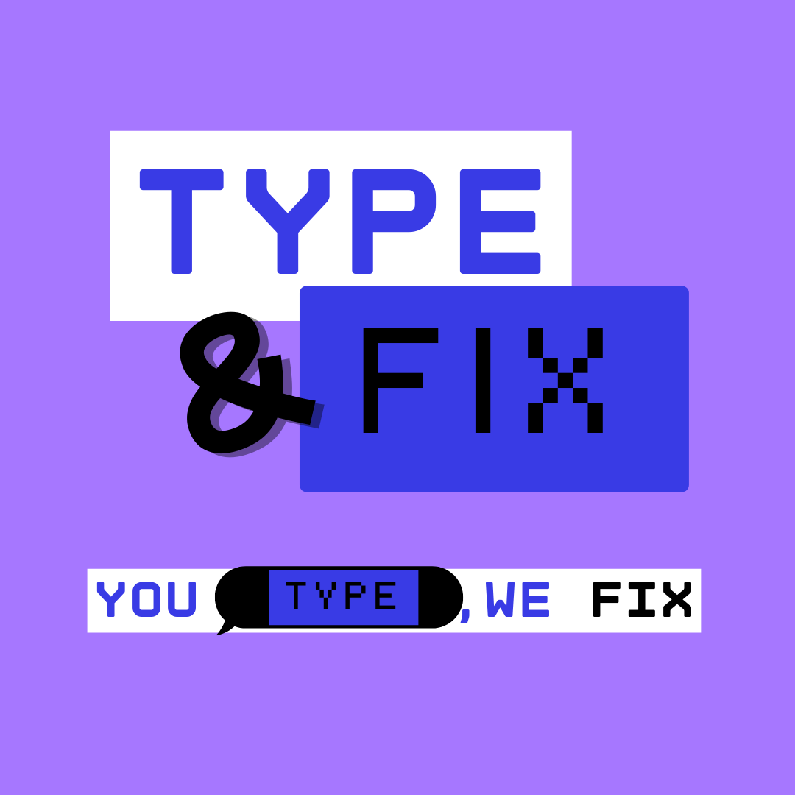
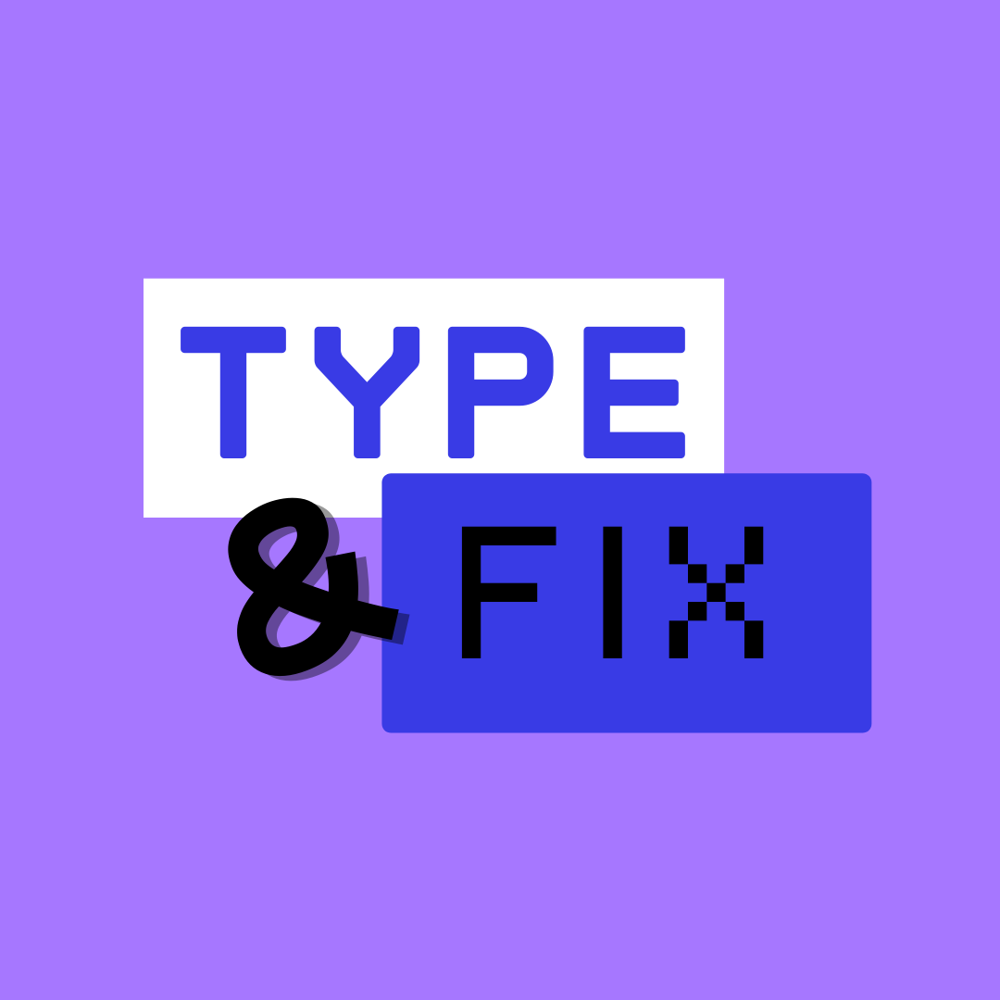
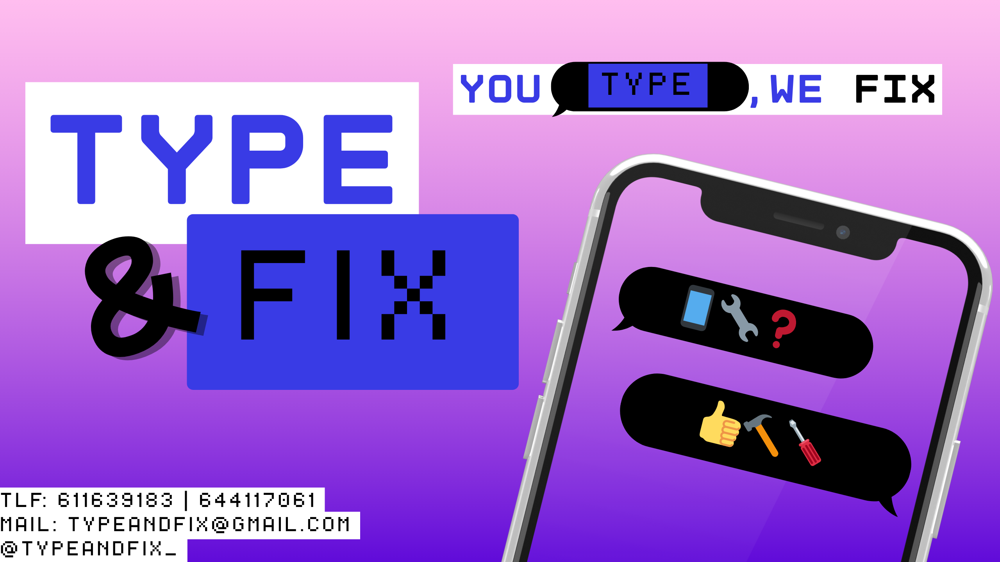
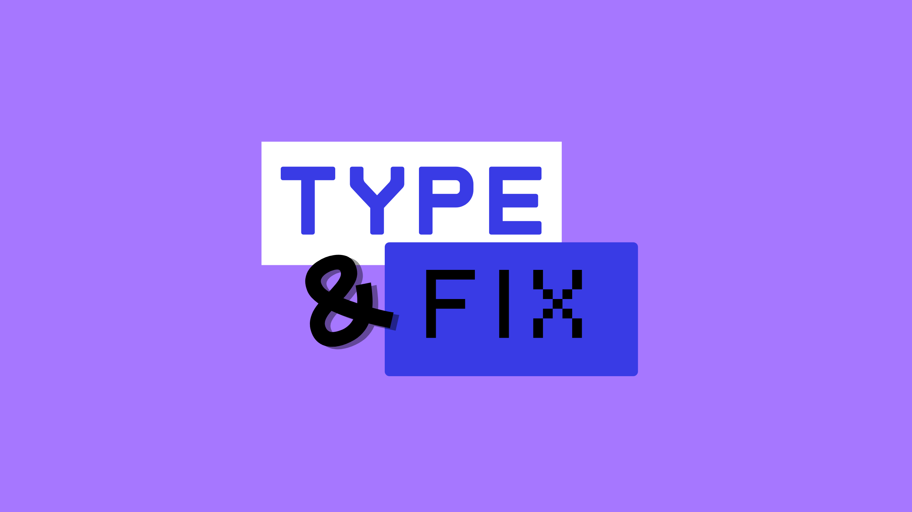
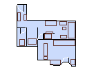
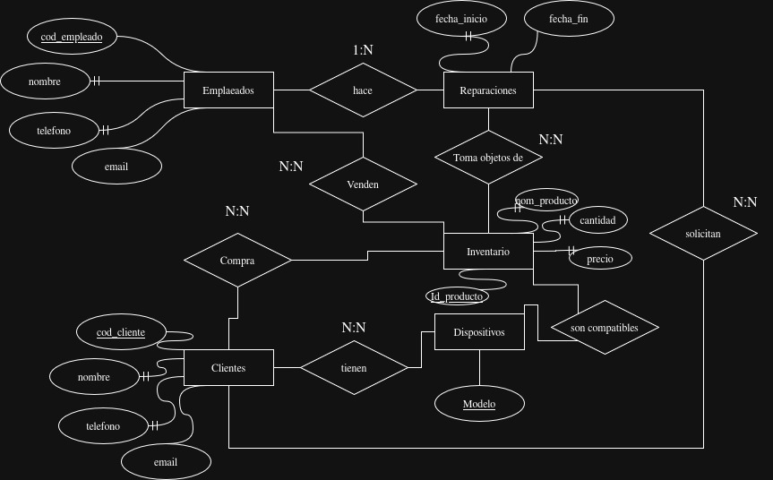

 Crea tu propia PIME

# 1.Venta y Reparacion de PCs

* A lo largo de este proyecto veremos la creacion, establecimiento, imagen de mercado, publico objetivo, y funcionamiento de la empresa **Type&Fix**.

Esta es una tienda de venta reparacion de equipos TIC que tambien brinda servicios a empresas cercanas.

## 1.1.Conceptuando Type&Fix: Ideas iniciales

### Porque "Type&Fix"?

Quieriamos, acercarnos todo lo posible al mercado juvenil, y nos parecio que "Type and fix" (Escribe y repara) da pie a un proceso muy descriptivo de como trabajamos. Escribenos, y nosotros nos haremos cargo de reparar tu equipo, un mensaje simple y conciso

### **Imagen de marca:** 
- Para los colores queriamos una seleccion de morados, color que esta muy presente en la juventud de hoy en dia, ademas de ser lrelacionado en las culturas hindues con la sabiduria y la claridad mental, ademas que en el mundo de la moda siempre ha dado una impresion de lujosidad y ostento.

- Utilizando estos colores, queremos lograr que nuestra imagen de marca represente calma, sabiduria, lujo y rebelidia, y todo ello se puede, y se ha representado a lo largo de los años por el color morado y sus derivados, ademas, que como comentabamos antes esta muy presente en los jovenes de hoy en dia, teniendo entre otras marcas o movimientos que lo tienen muy presente, **Twitch**, o **El feminismo**.

* El logo escojido es el siguiente:

### Donde esta Type&Fix??

Lo ubicaremos en el siguiente local:

[Haz click aqui y descubrelo](https://www.idealista.com/inmueble/105444478)

Este es un pequeño croquis de los planos, con los cuadros marrones siendo una podible disposicion de muebles, expositores, espacios de trabajo, etc...

Porque? Es un local situado en una zona decente de Masanassa, lugar con bastante poblacion, hay competencia, pero solo un par de tiendas muy centradas en la reparacion de mobiles, es posible que en ese terreno, inicalmente nos cueste implementarnos, pero al ofrecer mas servicios, llegado el momento, prevaleceremos.

## 1.2.Perfiles de clientes

* Se nos ha sido propuesto los siguientes perfiles, a los cuales debemos de proveerles de varias opciones para un equipo, estas se dividen en "Barato", "Equilibrado" y "Profesional".

- Estudiante que quiere equipos para la escuela, el instituto y la universidad.
- Persona que quiere equipos para jugar.
- Hombre de negocios que necesita movilidad y fiabilidad.
- Ciudadano con pocos conocimientos de informática, pero que necesita equipos para consultar información y ver contenido en streaming.
- Profesional que necesita un equipo para edición y grabación de vídeos.

### Estudiante - El poratil de ofimatica

* Opcion Barata : [Portátil Acer Aspire Lite 15.6" Intel Celeron N4500 4GB 128GB eMMC Plata Windows 11 S](https://www.pccomponentes.com/portatil-acer-aspire-lite-156-intel-celeron-n4500-4gb-128gb-emmc-plata-windows-11-s) - [219,00€]

* Opcion Equilibrada : [Portátil HP 255 G10 15.6" Ryzen 3 8GB 512GB SSD FreeDOS WiFi 6 USB-C Plata Oscuro](https://www.pccomponentes.com/portatil-hp-255-g10-156-ryzen-3-8gb-512gb-ssd-freedos-wifi-6-usb-c-plata-oscuro) + Servicio de instalacion de sistema operativo en tienda (Opcional) - [351,20€ + 25€ = 376,2 €]

* Opcion Profesional : [Portátil Lenovo IdeaPad Slim 3 Gen 8 15IRH8 Intel Core i5-13420H/16GB/1TB SSD/15.6"](https://www.pccomponentes.com/portatil-lenovo-ideapad-slim-3-gen-8-15irh8-intel-core-i5-13420h-16gb-1tb-ssd-156) - [449,00€]

### "Gamer" - El tope de gama

* Opcion Barata : [Pc custom](https://www.pccomponentes.com/lista-de-deseos?wishListId=Kr1tTQPIgWGWaf) + Servicio de instalacion de sistema operativo en tienda (Opcional) - [958.62€ + 25€ = 983.62€] 

* Opcion Equilibrada : [Portátil HP Victus Gaming 15-fa2040ns 15.6" Intel Core 7 240H 16GB 1TB SSD RTX 5060 Windows 11 Home](https://www.pccomponentes.com/portatil-hp-victus-gaming-15-fa2040ns-156-intel-core-7-240h-16gb-1tb-ssd-rtx-5060-windows-11-home-azul) - [1205,01€]

* Opcion Profesional : [PC custom](https://www.pccomponentes.com/configurador/CfCa6c328) + Servicio de instalacion de sistema operativo en tienda (Opcional) -  - [4.115,74€ + 25€ = 4.140,74€]

### El buisnessman - Portatil

* Opcion Barata : [Lenovo V14 G4 (14", Intel Core i5 / 8–16GB, 512GB SSD](https://www.pccomponentes.com/portatil-lenovo-v14-g4-iru-intel-core-i5-13420h-8gb-512gb-ssd-14) - [579,00€] 

* Opcion Equilibrada : [Lenovo ThinkPad E14 (14", Intel Core i5 o i7, 16 GB, 512 GB SSD](https://www.pccomponentes.com/lenovo-thinkpad-e14-gen-5-intel-core-i5-1335u-16gb-512gb-ssd-14) - [869,00€]

* Opcion Profesional : [Portátil PcCom Revolt 5050 AMD Ryzen 7 260/16GB/1TB SSD/RTX 5050/15.6" + Windows 11](https://www.pccomponentes.com/portatil-pccom-revolt-5050-amd-ryzen-7-260-16gb-1tb-ssd-rtx-5050-156-windows-11) - [1049,99€]

### El ciudadano promedio - Equipo multimedia

* Opcion Barata : [HP - PC Chromebook 14a-na0003sl, Intel Celeron N4020, 4 GB RAM, 64 GB eMMC, gráficos Intel UHD 600, Chrome OS, Google Play Store, pantalla 14" FHD, lector Micro SD](https://www.amazon.es/HP-Chromebook-14a-na0003sl-Notebook-gr%C3%A1ficos/dp/B0928MXNM3?utm_source=chatgpt.com) - [139,51€] 

* Opcion Equilibrada : [ASUS Vivobook Go 15 (E1504FA) — AMD Ryzen 5 7520U / 16 GB / 512 GB SSD / 15.6" FHD](https://www.pccomponentes.com/portatil-asus-vivobook-go-15-e1504fa-nj1354-amd-ryzen-5-7520u-16gb-512gb-ssd-156) - [369,00€]

* Opcion Profesional : [Portátil Acer Aspire 3 A315-59-51SV Intel Core i5-1235U/16GB/512GB SSD/15.6"](https://www.pccomponentes.com/portatil-acer-aspire-3-a315-59-51sv-intel-core-i5-1235u-16gb-512gb-ssd-156) - [399,00€]

### El editor - El tome de gama orientado al tratamiento de imagen

* Opcion Barata : [Pc custom](https://www.pccomponentes.com/configurador/5571D1403) + Servicio de instalacion de sistema operativo en tienda (Opcional) - [911,69€ + 25€ = 936,69€] 

* Opcion Equilibrada : [Pc custom](https://www.pccomponentes.com/configurador/8b9e9eDaD) + Servicio de instalacion de sistema operativo en tienda (Opcional) - [1.567,83€ + 25€ = 1.592,83€]

* Opcion Profesional : [Pc custom](https://www.pccomponentes.com/configurador/9cFa0e74E) + Servicio de instalacion de sistema operativo en tienda (Opcional) - [2.799,73€ + 25€ = 2.824,73€]

## 1.3.Reparacion de equipos

* En Type&Fix ofrecemos un maravilloso servicio de reparacion de equipos.

Las reparaciones simples de un movil suelen rondar entre la media hora y los  45 min para reparaciones simples, y hasta 6 horas para mas complejas

En Type&Fix, el precio de la reparacion para moviles consta del precio de la pieza + el precio/hora del tecnico, el cual es de 10€ / ½hora

## 1.4.Informatitzación de la información

# 2.Servicios a las PyME cercanas

Lastimosamente, en el mundo en el que vivimos actualmente, no se nos es posible vivir solo de los clientes de las reparaciones, asi que Type&Fyx hace mucho tiempo decidio implementar servicios orientado hacia las empresas locales, asegurandose siempre un flujo de beneficios minimo

## 2.1 Gestión de Incidencias

Es necesario plantear cómo recoger y gestionar las incidencias informáticas de las PYMES de la localidad. En nuesto casa, nuestra propuesta inmediata fue:

### Servicios de mensajería (WhatsApp, Telegram, etc.)

Propuesta: Crear un número corporativo de WhatsApp Business o un canal de Telegram.

Uso: Comunicación rápida, envío de fotos, vídeos o mensajes de voz con incidencias.

Ventaja: Método que muchas PYMES consideran cómodo e inmediato.

**Ademas de trebajar en siultaneo con un:**

### Formulario en línea

Propuesta: Diseñar un formulario con Google Forms o herramienta similar para registrar:

Empresa

Persona de contacto

Tipo de incidencia

Urgencia

Descripción

Adjuntos

Ventaja: Centralización ordenada de incidencias y creación directa de tickets.

### Coste por hora del mantenimiento informático

Segun una exaustiva busqueda y n par de llamadas, este podria ser un precio que ofrecer a las PyMES

Propuesta de tarifa:

Coste por hora estándar: 25–35 € / hora (según complejidad del servicio).

Bono mensual de mantenimiento:

Plan básico: 4 horas/mes → 80 €

Plan avanzado: 10 horas/mes → 180 €

Servicios fuera de horario: 45 € / hora (urgencias)

## 2.2.Empresas de telecomunicaciones

Hay que plantear distintas posibilidades de conexión para que las PYMES locales dispongan de conectividad a Internet mediante una empresa de telecomunicaciones, ya sea local o de ámbito nacional.

### Búsqueda de opciones

Se pueden considerar siguientes categorías:

Operadores nacionales: Movistar, Orange, Vodafone, MásMóvil.

Dossier con precios y conectividad ofertada

Ejemplo de dossier (resumen):

| Empresa               | Tipo de conexión  | Velocidad          | Precio mensual | Observaciones                          |
| --------------------- | ----------------- | ------------------ | -------------- | -------------------------------------- |
| **Movistar**          | Fibra             | 600 Mbps           | 39,90 €        | Amplia cobertura, servicio estable     |
| **Orange**            | Fibra             | 1 Gbps             | 42,95 €        | Velocidad alta, buena atención técnica |
| **Vodafone**          | Fibra             | 600 Mbps           | 36,00 €        | Económico, incluye router avanzado     |

## 2.3 Digitalización de documentación

Hoy en día cada vez es más necesario que la documentación esté digitalizada con la finalidad de poder compartirla y agilizar muchos trámites.
Por este motivo, la documentación física de las PYMES, especialmente pensando en su almacenamiento, termina siendo un problema por la cantidad de espacio que ocupa.
Para solucionarlo, se ofrece un servicio de digitalización y posterior almacenamiento en dispositivos (pendrives, discos duros, discos ópticos, la nube, etc.).

A continuación se detallan los costes iniciales, la organización del servicio y los precios finales ofrecidos al cliente.

### Costes iniciales para la empresa

Para poner en marcha el servicio es necesario adquirir o disponer de equipamiento especializado:

#### Escáneres para grandes cantidades de documentación

Equipamiento propuesto:

Escáner profesional de alimentación automática (ADF) para digitalizar a gran velocidad.

Escáner plano para documentos delicados.

Coste aproximado: 400–900 € por escáner ADF profesional.

#### Lectura de dispositivos antiguos (CD-ROMs, disquetes, cassettes/vinilos —si se ofrece como extra)

Equipamiento necesario:

Lector externo USB de CD/DVD → 20–30 €.

Lector USB de disquetes → 25–40 €.

Equipos especializados para audio digital (cassette/vinilo) si se ofrece → 80–150 €.

Justificación: Muchas PYMES aún conservan archivos en formatos obsoletos.

#### Lectura de diferentes formatos de tarjetas de memoria

Multilector de tarjetas (SD, microSD, CompactFlash, MS, etc.)

Coste: 15–25 €.

Uso: Recuperación de imágenes, documentos o copias antiguas.

#### Destrucción de documentación física

Opción 1: Trituradora propia

Trituradora industrial con corte en micropartículas.

Coste aproximado: 120–250 €.

Opción 2: Externalizar el servicio

Contrato con empresa certificada de destrucción.

Coste: 0,15–0,30 € por kg de papel.

### Coste temporal del servicio (mano de obra)

| Tipo de servicio                           | Tiempo estimado                     | Coste por hora propuesto | Coste al cliente    |
| ------------------------------------------ | ----------------------------------- | ------------------------ | ------------------- |
| Digitalización de documentos (escáner ADF) | 500–800 páginas/hora                | 20 €/h                   | ~0,03–0,05 €/página |
| Digitalización con escáner plano           | 30–60 páginas/hora                  | 20 €/h                   | ~0,35 €/página      |
| Lectura de CD/DVD                          | 5–10 min por disco                  | 20 €/h                   | 2–4 €/disco         |
| Lectura de disquetes                       | 5 min por disquete                  | 20 €/h                   | 1,5–2 €/disquete    |
| Conversión de audio/casette                | 1:1 (1 h de audio = 1 h de trabajo) | 20 €/h                   | 15–20 €/cinta       |
| Clasificación y renombrado de archivos     | Variable                            | 20 €/h                   | Según horas         |
| Destrucción de documentación               | 30–60 min por caja                  | 20 €/h                   | 10–15 € por caja    |

### Resultados finales ofrecidos al cliente

Una vez finalizado el servicio, la información digitalizada se puede entregar mediante distintos formatos y opciones de almacenamiento.

| Dispositivo          | Capacidad | Precio         |
| -------------------- | --------- | -------------- |
| Pendrive             | 16 GB     | 6 €            |
| Pendrive             | 32 GB     | 8 €            |
| Pendrive             | 64 GB     | 12 €           |
| Disco duro externo   | 1 TB      | 45–50 €        |
| Disco óptico DVD     | 4,7 GB    | 2 € por unidad |
| Disco óptico Blu-ray | 25 GB     | 5 € por unidad |

### Precios por almacenamiento en la nube de la empresa

| Plan en la nube  | Espacio   | Precio mensual | Precio anual |
| ---------------- | --------- | -------------- | ------------ |
| Plan Básico      | 10 GB     | 3 €/mes        | 30 €/año     |
| Plan Profesional | 50 GB     | 7 €/mes        | 70 €/año     |
| Plan Empresa     | 200 GB    | 15 €/mes       | 150 €/año    |
| Plan Ilimitado   | Ilimitado | 25 €/mes       | 250 €/año    |

### Posibles características del servicio: 

Acceso web + aplicación móvil.

Copia de seguridad redundante.

Servidores alojados en la empresa o proveedor cloud.

Cumplimiento de protección de datos.
