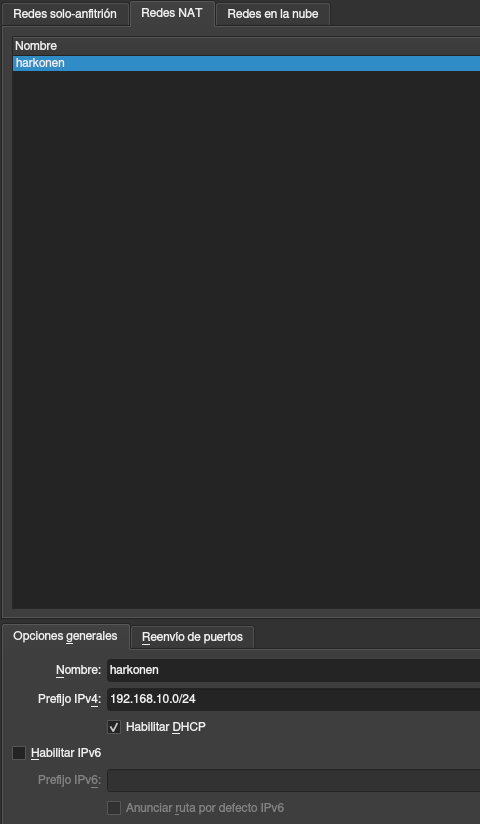
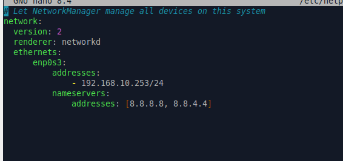
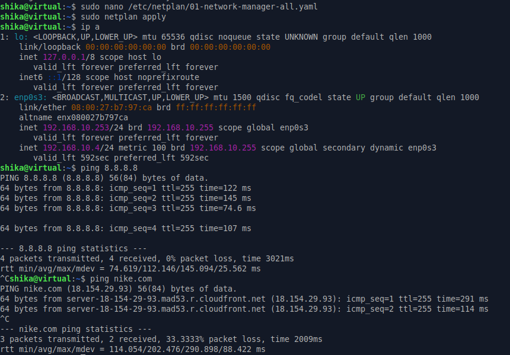
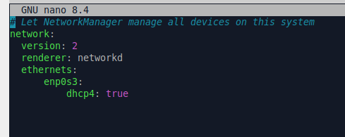
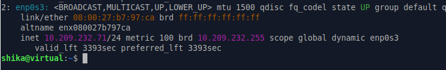
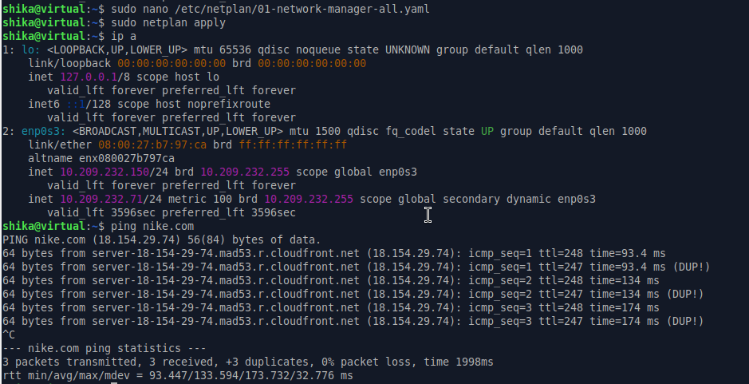
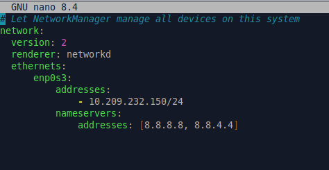

# Ejercicio 1

## a) Crea una Red NAT en VirtualBox de clase C (con su máscara por defecto), que te permita comunicarte con el clan Harkonnen. Adjunta una captura de la configuración de la Red NAT.

## b) En una máquina virtual en Linux, modifica la configuración de red para asignarle mediante configuración estática una dirección IP, máscara y puerta de enlace del rango de la Red NAT que has creado. Añade además los DNS de Conselleria. Adjunta una captura con el fichero de configuración y otra tras utilizar el comando correspondiente para ver que, efectivamente, se ha aplicado la configuración. Además, realiza un ping a alguna web externa para ver que todo funciona correctamente y adjunta también la prueba

# Ejercicio 2

## a) Modifica la configuración anterior para que la máquina virtual tenga configuración de red dinámica. A continuación cambia el modo de Red de esa máquina virtual en VirtualBox a “Adaptador puente”. Adjunta capturas donde se aprecien los cambios.

## b) Comprueba la dirección IP y la máscara que ha recibido la máquina. ¿Con qué facciones puedes comunicarte ahora? Adjunta captura donde se vea la configuración recibida y contesta a la pregunta.

* No podria comunicarme con ninguna faccion. Estoy solo. En el espacio

## c) Ahora debes modificar la máquina virtual para establecer una configuración de red estática compatible con la anterior. A partir de la configuración dinámica obtenida, pon una dirección IP del mismo rango pero con el último byte con el valor 100 + el valor del último byte de tu equipo físico. Ejemplo: si tu equipo físico es el 192.168.4.108, ahora debes poner como último byte 208. Si utilizas un portátil en vez de un ordenador del aula, súmale 40 en vez de 200. Comprueba primero si esa dirección está disponible. Adjunta captura/s donde se aprecie lo siguiente

# Ejercicio 3
## a) Se han oído rumores acerca de ciertos miembros de algunas facciones muy bien valorados y, por supuesto, quieres contactar con ellos para que te presten su servicio. Se trata de las hermanas 12 y 14 de las Bene Gesserit y de los guerreros 10 y 15 de los Sardaukar. Comprueba en la tabla arp de tu máquina virtual si aparecen estos guerreros/hermanas. Adjunta una captura de la comprobación

Pues no aparecen, no

