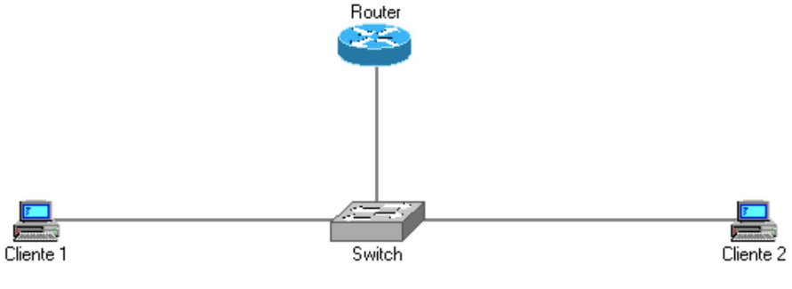

# TAREA 07 –Se desea configurar la siguiente red local utilizando direccionamiento IPv6. Para ello, deberán utilizarse dos direcciones de tipo UNICAST en cada interfaz, que serán GLOBAL y LINK-LOCAL.

|EQUIPO|IPv6 UNICAST GLOBAL/Máscara|IPv6 LINK-LOCAL|Gateway GLOBAL/LINK LOCAL|
|---|---|---|---|
|Router|2001:DB8:A:1::1/64|FE80::1|2001:DB8:A:1::1 (GLOBAL)|
|Cliente 1|2001:DB8:A:1::2/64|FE80::2|2001:DB8:A:1::1 (GLOBAL)|
|Cliente 2|2001:DB8:A:1::3/64|FE80::3|2001:DB8:A:1::1 (GLOBAL)|

