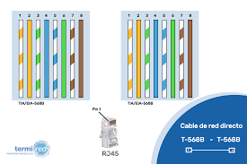

Utilizaria cruzado si conectara dos equipos iguales

MDI y MDI-X son formas de conexión en redes Ethernet que sirven para que los cables transmitan bien los datos entre dispositivos. Se usan desde hace años, desde las primeras redes Ethernet, y fueron desarrolladas por quienes crearon esos estándares, como parte del trabajo de la industria de redes.