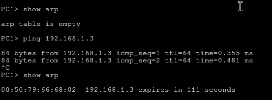
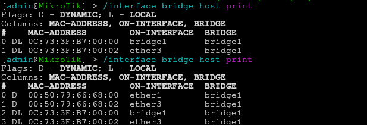

# 1 – Haz una o más búsquedas en Internet que te permitan expresar con tus palabras lo que es un bridge de red.

El bridge interconecta segmentos de red (o divide una red en segmentos) haciendo la transferencia de datos de una red hacia otra con base en la dirección física de destino de cada paquete

# 2 – Implementa el esquema básico de un Switch por defecto en GNS3 y 4 PC numerados del 1 al 4. Asigna las direcciones IP sucesivas en el rango 192.168.1.0/24, comenzando por la 1. Genera tráfico con ping del PC1 al PC3 y viceversa. Visualiza la tabla MAC del switch en el instante inicial y después de haber enviado una trama (ping) desde el PC1 al PC2. Visualiza en cada PC su ARP después de intercambiar PING. ¿Cómo visualizamos la tabla de direcciones MAC del Switch? Observa y responde ¿Qué resultados muestra la ARP en los PCs que han intercambiado el ping? ¿Cuál es el contenido de la tabla en esos instantes?

El pc no tenia nada en la tabal previo a el ping, despues de hacerlo ya tiene la mac del equipo que ha respondido, la ip, y el tiempo que la va a aguantar

Para mirar la arp del switch es tan facil como ejecutar el comando de la foto

# 3 - Observa y responde, ¿cuál es el contenido de la tabla en esos instantes?

Se ha eñadido las mac de os equipos que de han hechi pong entre si ademas de indicarnos su mac