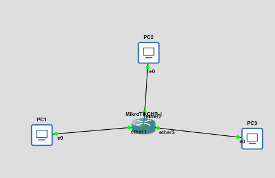
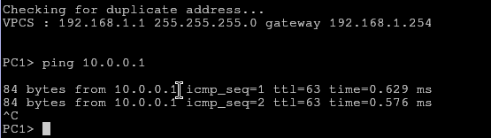

# TAREA 5.2 CONFIGURACIÓN DE INTERFACES EN EL ROUTER

El pc se ve con el 3 con ips y mascaras completamente diferentes

Para ello he tenido que dar ip a los equipos, y marcar a los pcs que su gateway es la que tenga su puerto correspondiente del router, ademas de configurar las ips de los routers