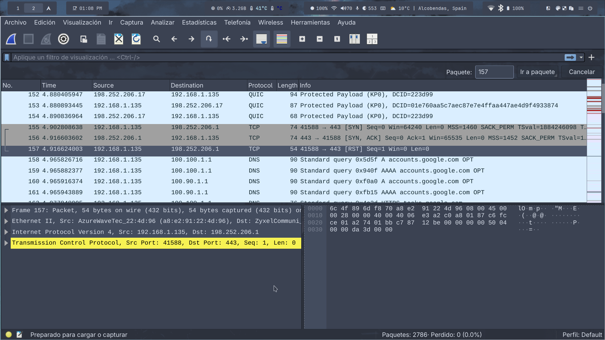

# Barra de herramientas:

## Listar interfaces de red.

Al presionar este botón aparecerá un dialogo que muestra las interfaces de red disponibles y permite iniciar una captura o modificar las opciones de captura, esta función no se puede acceder mientras se capturan los paquetes

## Opciones de captura.

Inicia el dialogo con las opciones para realizar la captura de paquetes, este botón se deshabilita durante la captura de paquetes

## Iniciar captura.

Inicia la captura con la interfaz seleccionada, no disponible durante la captura de paquetes.

## Detener captura.

Detiene la captura de paquetes, este botón solo esta habilitado si esta capturando paquetes

## Reiniciar captura de paquetes.

Comienza de nuevo la captura, agregando los paquetes a continuación de los ya capturados, esta función solo se activa si a detenido una captura en curso.

## Abrir un archivo de capturas.

Permite abrir un archivo con paquetes ya capturados, no disponible si esta ejecutando una captura.

## Guardar archivo de capturas.

Almacena los paquetes ya capturados para posterior análisis, no accesible durante la captura de paquetes.

## Cerrar archivo de captura.

Cierra el archivo actual, no disponible mientras se estén capturando paquetes.

## Recargar archivo de captura actual.

Elimina los cambios realizados y carga de nuevo el archivo de capturas actual, botón deshabilitado durante la captura de paquetes.

## Imprimir paquetes.

Imprime los paquetes capturados hasta el momento.

## Buscar un paquete.

Busca un paquete que coincida con los parámetros establecidos

## Ir hacia atrás.

Va al paquete seleccionado anteriormente

## Ir hacia adelante.

Va al paquete que se selecciono después del actual, solo disponible si uso el botón “Ir hacia atrás” anteriormente.

## Ir al paquete con numero.

Va al paquete con el numero indicado

## Ir al primer paquete.

Selecciona el primer paquete que se halla capturado

## Ir al ultimo paquete.

Lleva al ultimo paquete que se a capturado

## Colorear lista de paquetes.

Activa o desactiva el coloreado de la lista de paquetes, activado por defecto.

## Autocorrimiento.

Al activarse mantiene visibles los paquetes mas recientemente capturados, activa por defecto.

## Acercamiento.

Aumenta el tamaño de los elementos en la lista de paquetes

## Alejamiento.

Reduce el tamaño de los elementos en la lista de paquetes

## Escala normal.

Regresa los elementos de la lista de paquetes a su tamaño por defecto

## Redimensionar columnas.

Ajusta el tamaño de las columnas en la lista de paquetes

## Editar filtro de captura.

Abre el dialogo para aplicar un filtro a a la capturados

## Aplicar un filtro a los paquetes capturados.

Filtra los paquetes ya capturados

## Editar reglas de coloreado.

Permite modificar como se colorea la lista de paquetes.

## Preferencias

Modificar las preferencias del programa.

## Ayuda.

Abre la ayuda en linea.

# 2 - Captura de red

a). He capturado 2786 paquetes

b). Ha estado activo durante 23 segundos

# 4 - fotopaquete 

# 5 - Pregunats Paquete

157	4.916624003	192.168.1.135	198.252.206.1	TCP	54	41588 → 443 [RST] Seq=1 Win=0 Len=0

a). 192.168.1.135
b). 198.252.206.1
c). 54 bytes

d). tcp
e). tcp
f). tcp
g). tcp

