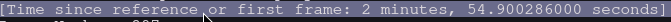
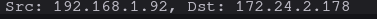
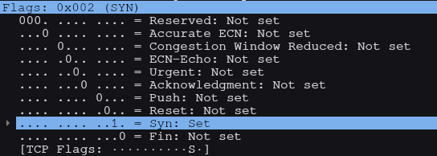
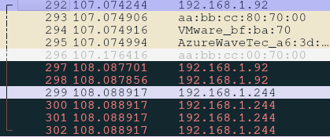
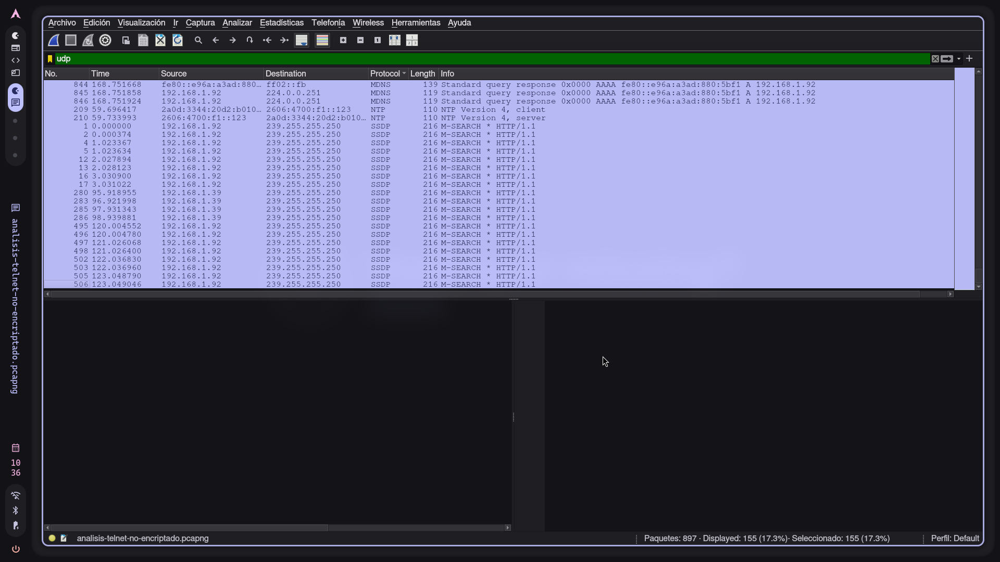
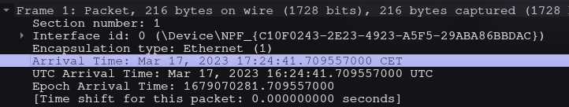
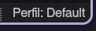

**Información a descubrir**

# 1- ¿Cuántos paquetes hay en la captura?

- Hay 897 paquetes

# 2- ¿Durante cuánto tiempo se ha estado capturando tráfico?

- 23.373045297 segundos

# 3- ¿Qué IP tiene el equipo que ha enviado el paquete nº21? y el nº22?

- Es 192.168.1.92

# 4- ¿Qué protocolo ha utilizado el paquete nº292?

- Usa el protocolo TCP

# 5- ¿Qué puerto origen ha utilizado ese mismo paquete?

- El 52582

# 6- ¿Qué flags TCP tiene activos ese mismo paquete nº292?

# 7- ¿Cuál es el siguiente paquete de esta conexión TCP?

- El 293

# 8- ¿Cuántos paquetes hay dentro de la sesión TCP del paquete Nº292?

# 9- ¿Cuántos paquetes UDP hay en la captura?

# 10- ¿Qué día y a qué hora se empezó a capturar?

# 11- ¿Qué perfil de Wireshark se está utilizando ahora mismo en tu PC?

# 13- Averigua el usuario y las contraseñas no encriptados y que están contenidos en esta captura

- Usuario: usuario

-Contraseña: 12341234

