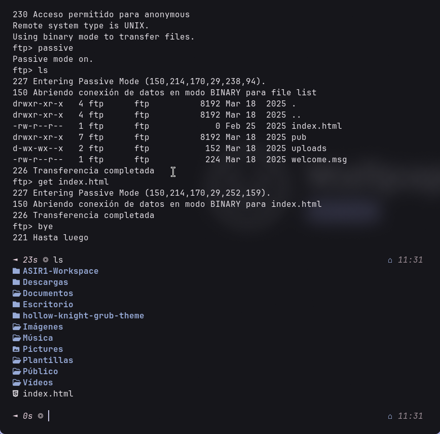
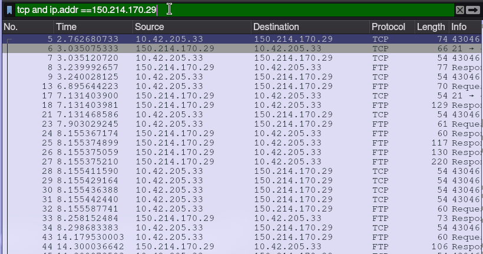
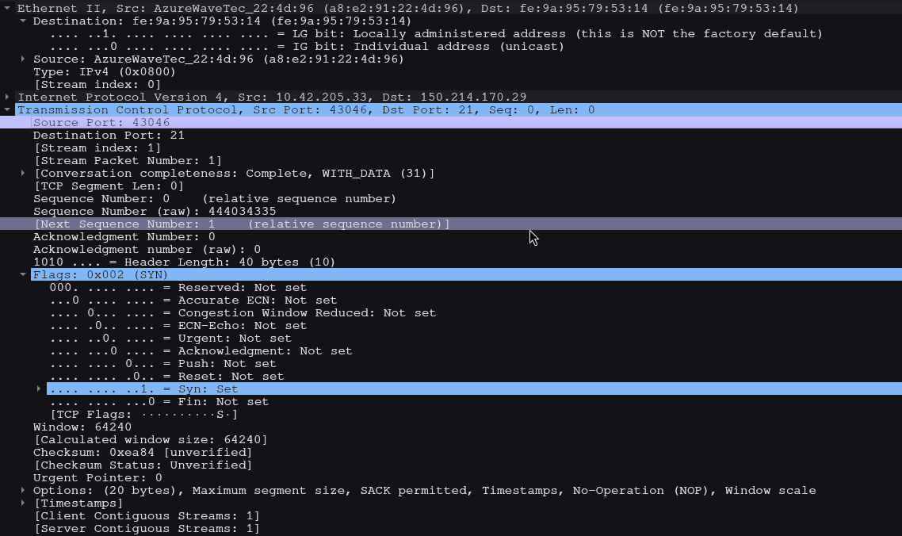
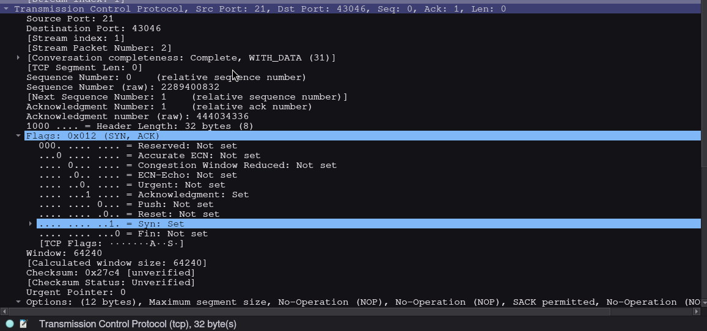
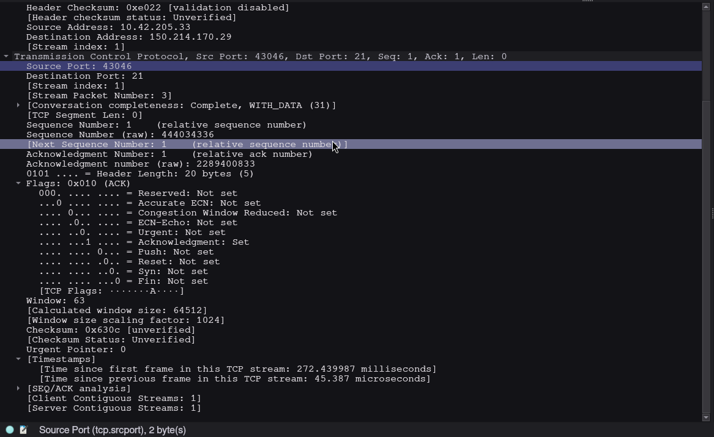
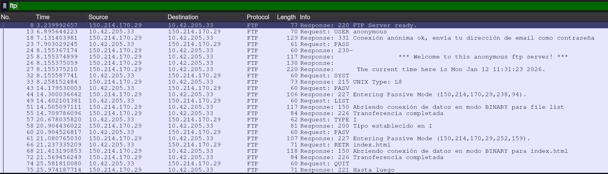

# Tcp connection

# Tcp filter results

# TCP SYN info

|  |  |
|:---|:---:|
| Dirección IP de origen: | 10.42.205.33 |
| Dirección IP de destino: | 150.214.170.29 |
| Número de puerto de origen: | 43046 |
| Número de puerto de destino: | 21 |
| Número de secuencia: | 0 |
| Número de acuse de recibo: | 0 |
| Longitud del encabezado: | 40 bytes |
| Tamaño de la ventana | 64240 |

# TCP SYN info

|  |  |
|:---|:---:|
| Dirección IP de origen: | 150.214.170.29 |
| Dirección IP de destino: | 10.42.205.33 |
| Número de puerto de origen: | 21 |
| Número de puerto de destino: | 43046 |
| Número de secuencia: | 0 |
| Número de acuse de recibo: | 1 |
| Longitud del encabezado: | 32 bytes |
| Tamaño de la ventana | 64240 |

# TCP SYN-ACK info

|  |  |
|:---|:---:|
| Dirección IP de origen: | 10.42.205.33 |
| Dirección IP de destino: | 150.214.170.29 |
| Número de puerto de origen: | 43046 |
| Número de puerto de destino: | 21 |
| Número de secuencia: | 1 |
| Número de acuse de recibo: | 1 |
| Longitud del encabezado: | 120 bytes |
| Tamaño de la ventana | 63 |

# FTP Filter

