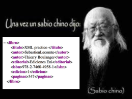

# Introducción a los Lenguajes de Marcas



Los **lenguajes de marcas** son sistemas de codificación que utilizan etiquetas (o *marcas*) para definir la estructura y el formato de un documento. A diferencia de los lenguajes de programación tradicionales, no contienen lógica de ejecución, sino que se centran en describir datos o cómo deben presentarse.

Estos lenguajes son fundamentales para la organización de información en la web, la comunicación entre sistemas y la documentación técnica.

---


## Lenguajes de Marcas Comunes

### 1. **JSON** (_JavaScript Object Notation_)

JSON es un formato ligero de intercambio de datos, fácil de leer y escribir para humanos, y fácil de interpretar para las máquinas. Se utiliza ampliamente para la comunicación entre aplicaciones web.

#### Ejemplo de JSON:

```json
{
  "Alumnos": [
    {
      "Alunmo 1":{
      "Nombre": "Daniel",
      "Apellidos": "López Fernández",
      "Localidad": "Sevilla",
      "Direccion": "Av. Andalucía, 135, 1ºB",
      "Telefono": "634 987 321"
     },
     "Alunmo 2":{
      "Nombre": "Marta",
      "Apellidos": "Sánchez Ruiz",
      "Localidad": "Madrid",
      "Direccion": "C/ Alcalá, 89, 4ºC",
      "Telefono": "699 112 233"
     },
     "Alunmo 3":{
      "Nombre": "Javier",
      "Apellidos": "Torres Morales",
      "Localidad": "Zaragoza",
      "Direccion": "Pza. Pilar, 17, 3ºD",
      "Telefono": "645 776 889"
     },
     "Alunmo 4":{
      "Nombre": "Cristina",
      "Apellidos": "Romero Delgado",
      "Localidad": "Bilbao",
      "Direccion": "C/ Gran Vía, 202, 5ºE",
      "Telefono": "678 554 210"
     },
     "Alunmo 5":{
      "Nombre": "Laura",
      "Apellidos": "Martínez Gómez",
      "Localidad": "Valencia",
      "Direccion": "C/ Mayor, 24, 2ºA",
      "Telefono": "612 345 678"
     } 
    }
  ]
}

```

### 2. **XML** (eXtensible Markup Language)

XML permite definir documentos con una estructura jerárquica y flexible, facilitando el intercambio de datos entre sistemas distintos. Es más verboso que JSON, pero también más estricto.

#### Ejemplo de XML:

```xml
<alumnos>
  <alumno id="alu1">
    <nombre>Laura</nombre>
    <apellidos>Martínez Gómez</apellidos>
    <localidad>Valencia</localidad>
    <direccion>C/ Mayor, 24, 2ºA</direccion>
    <telefono>612 345 678</telefono>
  </alumno>

  <alumno id="alu2">
    <nombre>Daniel</nombre>
    <apellidos>López Fernández</apellidos>
    <localidad>Sevilla</localidad>
    <direccion>Av. Andalucía, 135, 1ºB</direccion>
    <telefono>634 987 321</telefono>
  </alumno>

  <alumno id="alu3">
    <nombre>Marta</nombre>
    <apellidos>Sánchez Ruiz</apellidos>
    <localidad>Madrid</localidad>
    <direccion>C/ Alcalá, 89, 4ºC</direccion>
    <telefono>699 112 233</telefono>
  </alumno>

  <alumno id="alu4">
    <nombre>Javier</nombre>
    <apellidos>Torres Morales</apellidos>
    <localidad>Zaragoza</localidad>
    <direccion>Pza. Pilar, 17, 3ºD</direccion>
    <telefono>645 776 889</telefono>
  </alumno>

  <alumno id="alu5">
    <nombre>Cristina</nombre>
    <apellidos>Romero Delgado</apellidos>
    <localidad>Bilbao</localidad>
    <direccion>C/ Gran Vía, 202, 5ºE</direccion>
    <telefono>678 554 210</telefono>
  </alumno>
</alumnos>

```

### 3. **Markdown**

Markdown es un lenguaje de marcas ligero que permite dar formato a texto de manera sencilla y legible. Es muy utilizado en documentos README, blogs, foros, y plataformas como GitHub.

#### Ejemplo de Markdown:

```markdown
# Alumnos

## Alumno 1

### Nombre
Laura
### Apellidos
Martínez Gómez
### Localidad
Valencia
### Direccion
C/ Mayor, 24, 2ºA
### Telefono
612 345 678

## Alumno 2

### Nombre
Daniel
### Apellidos
López Fernández
### Localidad
Sevilla
### Direccion
Av. Andalucía, 135, 1ºB
### Telefono
634 987 321

## Alumno 3

### Nombre
Marta
### Apellidos
Sánchez Ruiz
### Localidad
Madrid
### Direccion
C/ Alcalá, 89, 4ºC
### Telefono
699 112 233

## Alumno 4

### Nombre
Javier
### Apellidos
Torres Morales
### Localidad
Zaragoza
### Direccion
Pza. Pilar, 17, 3ºD
### Telefono
645 776 889

## Alumno 5

### Nombre
Cristina
### Apellidos
Romero Delgado
### Localidad
Bilbao
### Direccion
C/ Gran Vía, 202, 5ºE
### Telefono
678 554 210

```
### 4. **Wikitext**

Wikitext es el lenguaje de marcas utilizado en plataformas como Wikipedia. Permite formatear texto, enlazar artículos, insertar imágenes, entre otras funciones, sin requerir conocimientos técnicos avanzados.

#### Ejemplo de Wikitext:

```wikitext
=Alumnos=

==Alumno 1==

===Nombre===
Laura
===Apellidos===
Martínez Gómez
===Localidad===
Valencia
===Direccion===
C/ Mayor, 24, 2ºA
===Telefono===
612 345 678

==Alumno 2==

===Nombre===
Daniel
===Apellidos===
López Fernández
===Localidad===
Sevilla
===Direccion===
Av. Andalucía, 135, 1ºB
===Telefono===
634 987 321

==Alumno 3==

===Nombre===
Marta
===Apellidos===
Sánchez Ruiz
===Localidad===
Madrid
===Direccion===
C/ Alcalá, 89, 4ºC
===Telefono===
699 112 233

==Alumno 4==

===Nombre===
Javier
===Apellidos===
Torres Morales
===Localidad===
Zaragoza
===Direccion===
Pza. Pilar, 17, 3ºD
===Telefono===
645 776 889

==Alumno 5==

===Nombre===
Cristina
===Apellidos===
Romero Delgado
===Localidad===
Bilbao
===Direccion===
C/ Gran Vía, 202, 5ºE
===Telefono===
678 554 210
```


[LINK RANDOM PORQUE NO SABIA DONDE METERLO](https://www.solvetic.com/tutoriales/article/4298-como-deshabilitar-ipv-6-en-windows-10/)

