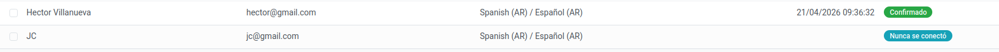
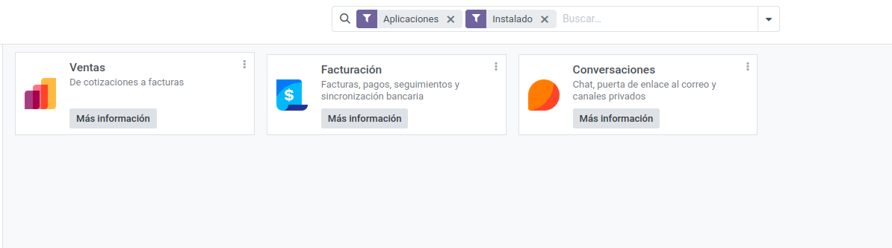
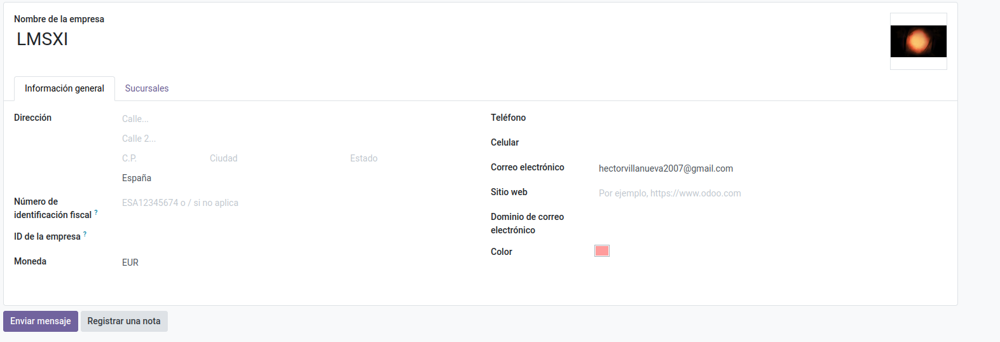
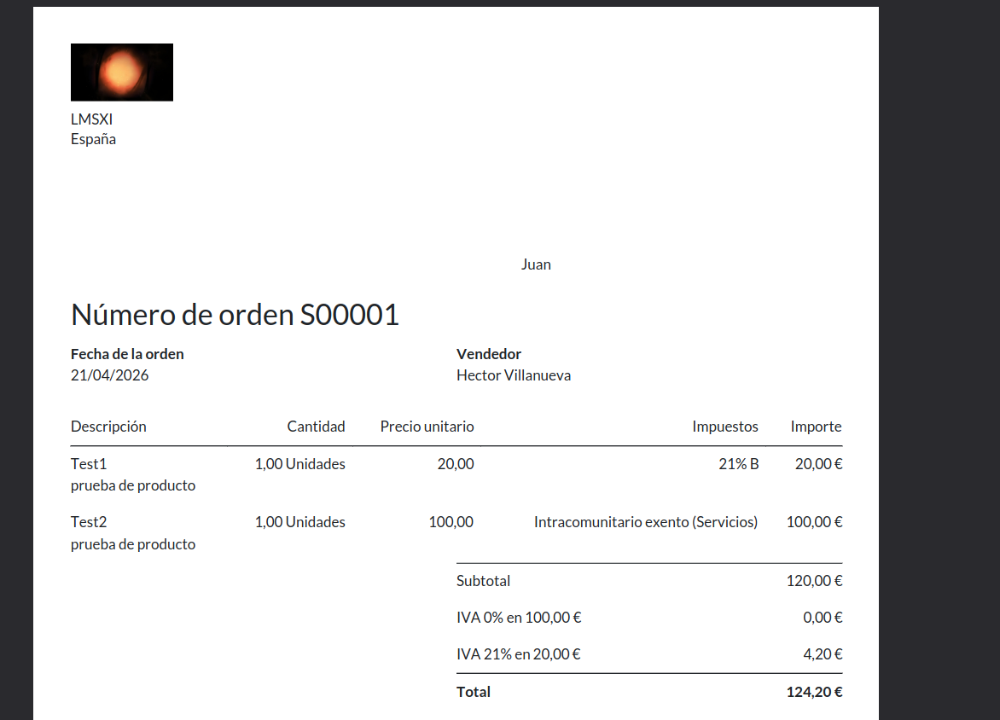

Vas a ajustes, luego usuarios y empresas, luego usuarios y creas el usuario administrador

Haces click en la barra de busqueda y haces click en instalados

Vas a ajustes, luego usuarios y empresas, luego luego empresas, y clicas en la de por defecto, cambias el nombre, pones foto y au

Vas a ventas, nuevo, pones el nombre del liente, los productos , los precios y el iva, luego le das a crear pdf

